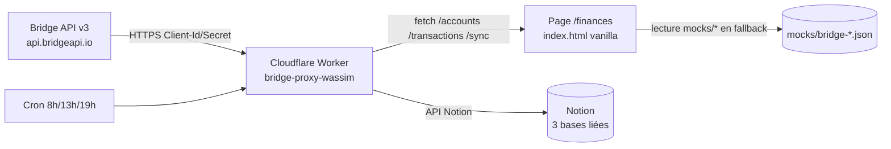

# Finances — Documentation

Page **Finances** du dashboard `nastyjesus/dashboard-wassim`. Agrège les 4
comptes bancaires (2 perso + 2 pro SOWPHOTO) via **Bridge API v3**, pousse
les transactions dans **Notion**, et expose un dashboard temps réel.

> **État actuel** : tout est livré en **mode mock-ready**. Le worker et la
> page Finances fonctionnent immédiatement avec les fixtures dans `mocks/`.
> Pour passer en production, il faut configurer un compte Bridge + un
> workspace Notion (voir étapes ci-dessous).

---

## 1. Architecture



**Flux nominal** :
1. Bridge agrège les transactions et soldes des 4 banques (Fortuneo, Trade
   Republic, Banque Populaire, Qonto).
2. Le worker `bridge-proxy-wassim` (Cloudflare Workers) interroge Bridge,
   nettoie/catégorise, puis upsert vers les bases Notion (idempotent sur
   `bridge_transaction_id`).
3. Le cron du worker rejoue ce sync 3 fois par jour automatiquement.
4. Le dashboard interroge le worker pour afficher KPI, graphiques,
   tableau et insights.
5. En l'absence de credentials Bridge, le worker tourne en `MOCK_MODE` et
   le front retombe sur les fixtures statiques `mocks/bridge-*.json`.

---

## 2. Stack & décisions techniques

- **Front** : vanilla HTML/CSS/JS (extension de `index.html` existant).
  Pas de React/Vite : on conserve la stack simple du repo.
- **Graphiques** : SVG natif inline, sans dépendance externe.
- **Worker** : Cloudflare Workers (module ESM, `compatibility_date 2025-01-15`).
- **Tests worker** : Vitest. Les requêtes fetch sont stubbées dans les tests.
- **Persistance config front** : `sessionStorage` (volatile, pas de
  localStorage). Les credentials sensibles ne sont jamais commités.
- **Auth worker ↔ front** : header partagé `X-Wassim-Auth`.

---

## 3. Inscription Bridge

Bridge est un agrégateur DSP2 français régulé ACPR. Le programme est B2B.

1. **Sandbox (gratuit)** : crée un compte sur https://dashboard.bridgeapi.io.
   Tu obtiens un `Client-Id` + `Client-Secret` sandbox utilisables tout de
   suite avec des banques fictives (utile pour tester le flow complet).
2. **Production** : pour un usage perso (1 utilisateur, 4 comptes,
   ~200-500 tx/mois), demander un plan starter au commercial Bridge en
   décrivant l'usage. Si Bridge refuse les comptes individuels : prévoir
   le fallback **Powens** (l'abstraction `BridgeClient` du worker permet
   de basculer sans toucher au front — il suffit de réécrire `bridge-client.js`).
3. **eIDAS** : non requis pour ton usage (lecture-seule sur tes propres
   comptes). Bridge gère la conformité PSD2.

### Endpoints utilisés
- `GET /v3/aggregation/accounts` — liste des comptes + soldes.
- `GET /v3/aggregation/transactions?since=ISO_DATE&limit=100` — paginé.
- `POST /v3/aggregation/connect-sessions` — flow d'ajout d'une banque.

Headers communs requis :
```
Bridge-Version: 2025-01-15
Client-Id: $BRIDGE_CLIENT_ID
Client-Secret: $BRIDGE_CLIENT_SECRET
Authorization: Bearer $BRIDGE_ACCESS_TOKEN
```

---

## 4. Mise en route — étapes ordonnées

### 4.1 — Tester en mode mock (zéro config)

```bash
# Ouvre simplement index.html dans un navigateur (ou via GitHub Pages),
# clique sur l'onglet "Finances". Les données viennent de mocks/bridge-*.json.
python3 -m http.server 8000
# puis http://localhost:8000/index.html → onglet Finances
```

Le bandeau de statut affiche `Mode mock · N tx`.

### 4.2 — Créer les 3 bases Notion

```bash
# 1. Créer une "Internal Integration" sur https://notion.so/my-integrations
#    → récupérer le token (commence par "secret_" ou "ntn_")
# 2. Partager la page parent (workspace Agency, ID 150fe946-b384-8040-807a-fe386df26fdd)
#    avec ton intégration depuis l'UI Notion : ··· → Connections → ton intégration.
# 3. Lancer le script de création :
NOTION_TOKEN=secret_xxx \
NOTION_PARENT_PAGE_ID=150fe946b3848040807afe386df26fdd \
node scripts/create-notion-dbs.js
```

Le script crée :
- 💳 Comptes bancaires (4 propriétés clés + bridge_account_id)
- 📊 Transactions (lié à Comptes et Catégories, avec bridge_transaction_id)
- 🏷️ Catégories (pré-rempli avec ~30 entrées Pro/Perso/Mixte)

Les IDs des bases sont écrits dans `docs/notion-ids.local.json` (gitignoré).

### 4.3 — Déployer le worker Cloudflare

```bash
cd workers/bridge-proxy
npm install
npx wrangler login              # première fois uniquement

# Provisionner les secrets (un par un, prompt interactif)
npx wrangler secret put NOTION_TOKEN
npx wrangler secret put NOTION_DB_ACCOUNTS_ID
npx wrangler secret put NOTION_DB_TRANSACTIONS_ID
npx wrangler secret put NOTION_DB_CATEGORIES_ID
npx wrangler secret put WASSIM_AUTH_TOKEN          # un secret long aléatoire

# Plus tard, quand Bridge est prêt :
npx wrangler secret put BRIDGE_CLIENT_ID
npx wrangler secret put BRIDGE_CLIENT_SECRET
npx wrangler secret put BRIDGE_ACCESS_TOKEN

# Déploiement
npx wrangler deploy
```

Tester :
```bash
curl https://bridge-proxy-wassim.<your-subdomain>.workers.dev/health
# → {"ok":true,"ts":"2026-..."}
```

### 4.4 — Brancher le front sur le worker

1. Dans la page Finances, déplie la section **⚙️ Configuration Bridge / Worker**.
2. Saisis l'URL du worker et le `WASSIM_AUTH_TOKEN`.
3. Clique **Tester /health** → doit afficher `✅ Worker OK`.
4. Clique **💾 Enregistrer**. La page recharge les données depuis le worker.
5. Le bandeau de statut passe à `Connecté · N tx`.

### 4.5 — Connecter une banque (production uniquement)

```bash
curl -X POST https://bridge-proxy-wassim.../auth/connect \
  -H "X-Wassim-Auth: $WASSIM_AUTH_TOKEN" \
  -H "Content-Type: application/json" \
  -d '{"external_user_id": "wassim_loumi"}'
```

La réponse contient une `url` que tu ouvres dans le navigateur. Bridge te
redirige vers le portail d'authentification de ta banque (Fortuneo, BP, etc.)
et stocke le lien (item) une fois le flow terminé. À répéter pour les 4 banques.

### 4.6 — Sync manuel

```bash
curl -X POST https://bridge-proxy-wassim.../sync \
  -H "X-Wassim-Auth: $WASSIM_AUTH_TOKEN"
```

Le cron déclenche aussi `/sync` automatiquement à 8h, 13h, 19h Paris.

---

## 5. Variables d'environnement

| Nom | Provisionné où | Description |
|---|---|---|
| `BRIDGE_CLIENT_ID` | wrangler secret | Identifiant partenaire Bridge |
| `BRIDGE_CLIENT_SECRET` | wrangler secret | Secret partenaire Bridge |
| `BRIDGE_ACCESS_TOKEN` | wrangler secret | Token utilisateur (généré au connect) |
| `NOTION_TOKEN` | wrangler secret | Token de l'intégration Notion |
| `NOTION_DB_ACCOUNTS_ID` | wrangler secret | ID de la base Comptes bancaires |
| `NOTION_DB_TRANSACTIONS_ID` | wrangler secret | ID de la base Transactions |
| `NOTION_DB_CATEGORIES_ID` | wrangler secret | ID de la base Catégories |
| `WASSIM_AUTH_TOKEN` | wrangler secret + sessionStorage front | Header partagé front ↔ worker |
| `MOCK_MODE` | wrangler vars (`wrangler.toml`) | "true" tant que pas de credentials Bridge |
| `ALLOWED_ORIGINS` | wrangler vars | Origines CORS autorisées |

**Côté front** : aucun secret n'est en dur dans `index.html`. Les
identifiants sont saisis via la section Configuration repliable de la
page Finances et stockés en `sessionStorage` (volatile).

---

## 6. Sécurité

- Pas de secret en dur dans le code (vérifier avec `git grep -i "secret_\|ntn_\|bridge"`).
- `IBAN` complet jamais stocké : seulement les 4 derniers chiffres dans Notion.
- Pas de `console.log` de montants : voir `workers/bridge-proxy/src/logger.js`
  qui filtre automatiquement les clés sensibles.
- Le worker exige `X-Wassim-Auth` sur tous les endpoints sauf `/health`.
- CORS strict : seules les origines listées dans `ALLOWED_ORIGINS` sont
  autorisées.

---

## 7. Tests

### Worker
```bash
cd workers/bridge-proxy
npm test
# → 12 tests verts (auth, CORS, mocks, sync, idempotence, catégorisation)
```

### E2E manuel — checklist 10 actions
1. [ ] Ouvre la page Finances → 4 comptes affichés, KPI total > 0.
2. [ ] Bascule scope Tout → Pro → Perso : KPI changent en cohérence.
3. [ ] Change la période 7j / 30j / 90j / 12 mois : graphiques redessinés.
4. [ ] Évolution des soldes : 4 lignes, légende cohérente.
5. [ ] Cashflow mensuel : 12 colonnes, entrées en vert / sorties en rouge.
6. [ ] Top dépenses : au moins 5 catégories, montants décroissants.
7. [ ] Tableau transactions : recherche `Adobe` ne renvoie que des lignes Adobe.
8. [ ] Édition catégorie inline : la valeur reste après changement de filtre.
9. [ ] Bouton Anonymiser : tous les montants floutés.
10. [ ] Export CSV : fichier téléchargé, ouvert dans Excel/Numbers, séparateur ;.

---

## 8. Troubleshooting

### "Erreur : worker HTTP 401"
→ Le `X-Wassim-Auth` ne match pas le secret Cloudflare. Re-saisis-le dans
la section Configuration ou re-provisionne le secret côté worker.

### "Failed to fetch" sur le worker
→ Probable problème CORS. Vérifie que ton URL d'origine (ex.
`https://nastyjesus.github.io`) est bien dans `ALLOWED_ORIGINS` dans
`wrangler.toml`, puis `npx wrangler deploy`.

### Les 4 banques ne se reconnectent pas seules
→ Bridge demande une re-authentification tous les 90 jours pour chaque
banque (réglementation DSP2). Le cron va simplement skipper les comptes
en `last_refresh_status: 'reconnect_required'`. La page Finances affiche
une alerte dans la section Insights pour t'avertir de relancer le flow
`/auth/connect`.

### Trade Republic MFA instable
→ TR utilise des tokens à courte durée. Si la connexion casse plus
souvent que les autres banques, considère de la passer en **lecture
manuelle** (export CSV mensuel) plutôt que via Bridge.

### Doublons dans Notion
→ Le sync est idempotent grâce à `bridge_transaction_id`. Si tu vois
quand même des doublons, c'est probablement un import manuel passé en
parallèle. Filtre la base Transactions sur `bridge_transaction_id is empty`
et nettoie.

### Le worker tourne en mock alors que je veux du live
→ Vérifie `wrangler.toml` (`MOCK_MODE = "true"`) et écrase :
`echo "false" | npx wrangler secret put MOCK_MODE`. Re-deploy.

---

## 9. Bonus (TODO, hors scope MVP)

- [ ] Export FEC (Fichier d'Écritures Comptables) conforme admin fiscale.
- [ ] Persistance des edits inline dans Notion via `PATCH /transactions/:id`
      (squelette présent dans le worker, à câbler côté backend).
- [ ] Alertes push via Telegram/Discord quand un seuil critique est atteint.
- [ ] Détection automatique des transactions miroirs (vir interne entre
      ses propres comptes) pour ne pas les compter dans le cashflow.
